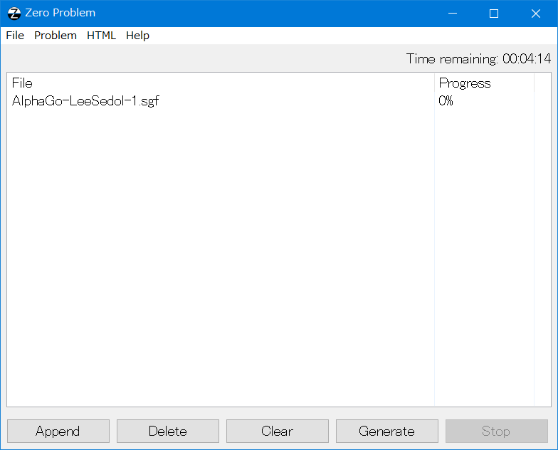
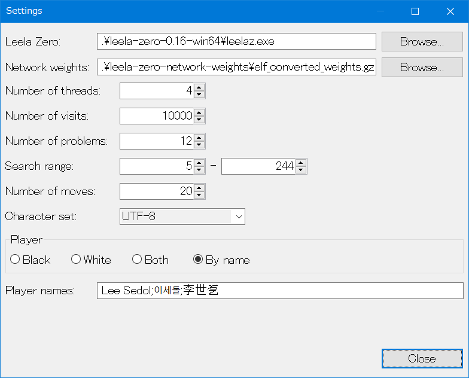
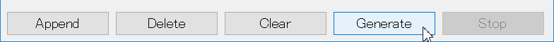
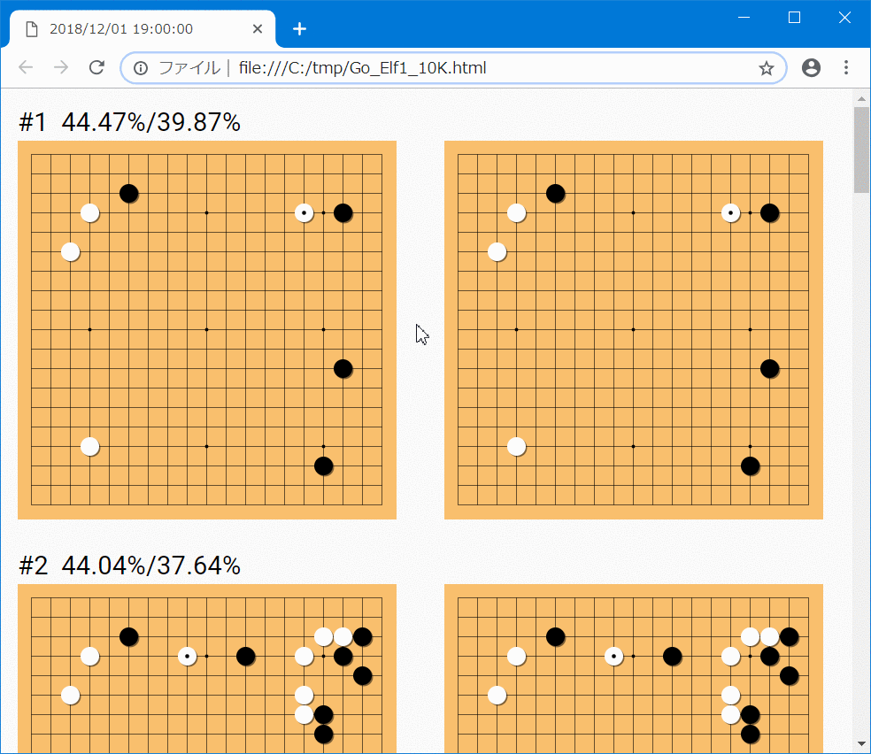

# Zero Problem
Zero Problem is a software which generates Go problems from your or someone's Go game records using [Leela Zero](https://zero.sjeng.org/). It works on Windows Vista and later.

## Demo
Zero Problem can generate interactive and printable htmls. Here's an example:

1. Set [a SGF file](./for_readme/AlphaGo-LeeSedol-1.sgf).

2. Change some settings.

3. Click 'Generate'.

4. Get [an HTML file](./for_readme/Go_Elf1_10K.html).

## Download
You can download the latest binary of Zero Problem for Windows from [here](https://github.com/colonq/zero-problem/releases).

## Licence
The source codes of Zero Problem is released under the Creative Commons CC Zero License 1.0, but this software requires wxWidgets, Leela Zero, Roboto which are released under specific licenses. See [license.html](./src/Licenses/license.html) for details.
